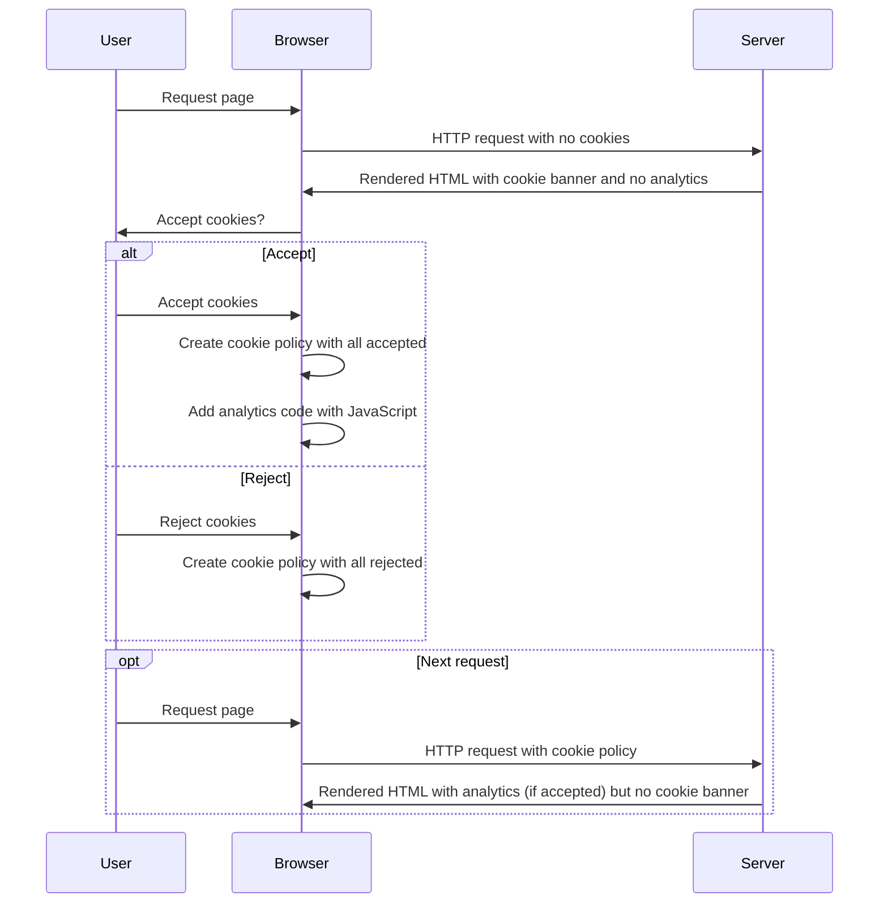
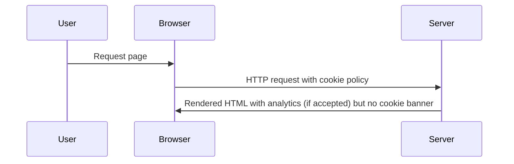

# Cookies

The principles of cookie handling are:

- Create cookies on the client side (apart from session cookies)
- Update cookies on the client side (apart from session cookies)
- Reject by default (don't assume acceptance and don't add tracking until after they agree)

## Policies

As standard we use three classes of cookies:

- `essential` - we don't need to ask permission for these
- `usage` - analytics, tracking, data gathering
- `settings` - configured options for the site (e.g. default results view or static light/dark mode)

## Process

### First visit



### Repeat visit



## Cookie library

When you load in the tna-frontend JavaScript, it comes with a [cookie library](https://github.com/nationalarchives/tna-frontend/blob/main/src/nationalarchives/lib/cookies.mjs).

This is loaded into the `window` object as `TNAFrontend.Cookies`:

```js
// Initialise a new Cookie instance
const cookies = new window.TNAFrontend.Cookies();

// Log all the cookies to the console
console.log(cookies.all);
```

If you are building your own JavaScript, you can import the cookies class from `all.mjs` or `all+analytics.mjs`:

```js
import { Cookies } from "@nationalarchives/frontend/nationalarchives/all.mjs";

const cookies = new Cookies();

console.log(cookies.all);
```
